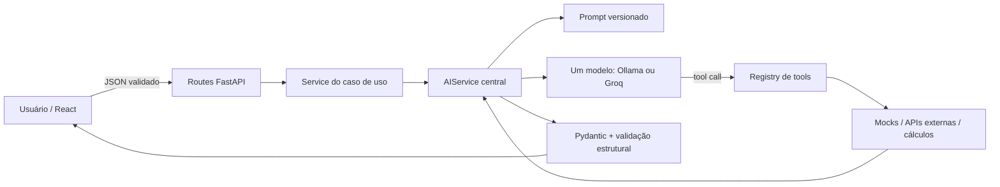

# ViajaReal — planejamento de viagens com IA generativa

O ViajaReal é uma aplicação React + FastAPI que centraliza pesquisa de destinos, relatos, orçamento e planejamento de viagens. Uma única camada de IA generativa é reutilizada pelo chatbot, planejador, melhoria de relatos e resumo de experiências.

Os dados são sempre identificados por origem:

- **reais:** localização do Nominatim/OpenStreetMap, clima do Open-Meteo e imagens da Pexels;
- **mockados:** destinos brasileiros, atrações, custos-base e relatos internos;
- **gerados por IA:** sínteses textuais fundamentadas nos dados e tools.

A IA não inventa um roteiro quando o catálogo interno não possui atrações suficientes.

## Problema e solução

Planejar uma viagem normalmente exige reunir relatos, estimar custos, pesquisar clima e organizar um roteiro em ferramentas separadas. O ViajaReal combina essas tarefas e usa IA para interpretar a intenção, selecionar tools especializadas e apresentar o resultado em cards estruturados.

Principais fluxos:

- chatbot flutuante em todas as páginas;
- planejamento por duração, orçamento, companhia, conforto e interesses;
- busca e síntese de relatos;
- cálculo determinístico de orçamento;
- comparação de destinos;
- organização de relatos sem alterar fatos ou gastos;
- contexto real de localização, clima e imagens.

## Arquitetura de LLM



Fluxo principal: **frontend → endpoint → service → AIService → modelo/tools → schema → frontend**.

As routes validam HTTP e não concentram lógica de IA. Services como `MainChatService`, `TripPlannerService` e `ReportAIService` definem o caso de uso. `AIService` concentra provider, tool calling, limite de ciclos, structured output, logs e fallback.

Não há múltiplos agentes. Há **um único modelo** com tools especializadas. Também não há RAG: o volume de dados é pequeno, estruturado e cabe em tools determinísticas. LangChain/LangGraph adicionariam abstrações e dependências sem resolver um problema necessário nesta versão.

## Escolha de framework e provider

### Por que FastAPI + chamada direta/SDK

- FastAPI e Pydantic validam entradas e respostas estruturadas no backend.
- Ollama é acessado por `httpx` através da API OpenAI-compatible, evitando um SDK adicional.
- Groq usa o SDK oficial, que normaliza timeout, erros HTTP e tool calling.
- Um adapter comum permite trocar o provider sem duplicar services ou expor chaves ao frontend.
- A abordagem direta deixa o ciclo de tools visível e fácil de explicar durante a avaliação.

### Por que Ollama com `llama3.2`

O provider principal é local porque não exige pagamento, preserva as mensagens no computador e não depende de cota externa. `llama3.2` cabe no hardware disponível e suporta o fluxo demonstrativo.

Trade-offs observados:

- maior latência que APIs hospedadas;
- tool calling e JSON menos consistentes;
- prompts longos prejudicam obediência e tempo de resposta;
- qualidade de síntese inferior a modelos pagos maiores;
- privacidade e custo previsível são melhores.

Com um modelo pago de maior capacidade, a expectativa é melhorar seleção de tools, aderência a schemas, sínteses e tolerância a prompts maiores. Ainda assim, validação, cálculos e regras críticas continuariam no código.

Groq permanece como alternativa com `AI_PROVIDER=groq`, sem mudar os endpoints ou o frontend.

## Parâmetros e justificativas

| Parâmetro | Valor | Decisão |
|---|---:|---|
| `temperature` | `0.3` | Reduz variação e fabricação sem deixar a redação completamente rígida. |
| `top_p` | `0.9` | Mantém diversidade moderada; atua junto da temperatura baixa. |
| `AI_MAX_TOKENS` | `600` local | Limita latência e respostas excessivamente longas. |
| `AI_TIMEOUT_SECONDS` | `90` | O modelo local pode carregar lentamente na primeira chamada. |
| `AI_MAX_TOOL_CYCLES` | `2` | Impede loops de tools e mantém custo/latência controlados. |
| `stream` | `false` | O backend precisa validar o JSON completo antes de responder. |

### Experimento de temperatura

Foi executado o mesmo pedido curto no `llama3.2`, mantendo `top_p=0.9` e limite de 180 tokens:

| Temperatura | Latência observada | JSON com `answer` válido |
|---:|---:|---|
| `0.0` | 7,5 s | Sim |
| `0.3` | 8,8 s | Sim |
| `0.7` | 7,3 s | Sim |

A amostra tem apenas uma execução por valor, portanto não prova diferença de desempenho. `0.3` foi mantido por coerência e controle semântico, não pela menor latência.

Em testes do fluxo completo, o prompt longo com few-shot chegou a aproximadamente 50 segundos e interpretou incorretamente envelopes de confiança. O prompt compacto respondeu entre aproximadamente 17 e 25 segundos; uma busca de relatos com tool respondeu em aproximadamente 9 segundos.

## Estratégia de prompting

Prompts versionados em `prompts/`:

- `travel_assistant_system.txt`: persona, objetivo, escopo, regras, estratégia, schema e estilo;
- `travel_assistant_few_shot.json`: planejamento, orçamento e destino sem dados;
- `report_improvement.txt`: preservação de fatos, números, gastos e texto original;
- `destination_reports_summary.txt`: síntese sem recalcular estatísticas;
- `ollama_chat_system.txt`: derivação compacta para o chatbot local;
- `ollama_trip_planner_system.txt`: derivação compacta para síntese do planejador local.

Técnicas usadas:

- **few-shot** para demonstrar formato e comportamento com dados insuficientes;
- **structured output** validado no backend;
- **grounding por tools**, mantendo fatos fora da geração livre;
- **separação de confiança** com mensagens system e envelopes `untrusted_*`;
- **pergunta única** quando falta informação essencial;
- prompts compactos específicos para modelos locais pequenos.

O prompt completo e os few-shot são usados nos providers/casos em que a latência permite. No Ollama, versões compactas preservam as regras essenciais; segurança crítica também é aplicada deterministicamente no backend.

## Tools e justificativas

Todas possuem descrição para a LLM, JSON Schema tipado, `additionalProperties=false`, validação e contrato `{ok, data, error}`.

| Tool | Por que existe |
|---|---|
| `search_destination_reports` | Recupera experiências internas sem colocar todo o catálogo no prompt. |
| `get_destination_information` | Fornece dados estruturados do destino e evita fatos inventados. |
| `calculate_trip_budget` | Mantém totais, média, saldo e classificação fora da LLM. |
| `generate_itinerary_base` | Seleciona atrações existentes, respeita interesses/orçamento e evita repetição. |
| `compare_destinations_data` | Calcula critérios e aderência de maneira reproduzível. |
| `get_live_destination_context` | Combina geocodificação e clima com fonte, horário e limitações. |

O modelo seleciona somente entre tools compatíveis com a intenção validada. Argumentos críticos são preservados pelo backend. O máximo de ciclos é limitado e tools desconhecidas são rejeitadas.

## Structured output e fallback

Contrato do chatbot:

```json
{
  "answer": "string",
  "type": "general | trip_plan | budget | reports | comparison | report_improvement | destination_summary",
  "tools_used": ["string"],
  "suggestions": ["string"],
  "data": {},
  "limitations": []
}
```

O backend valida JSON, tipos e campos antes de enviar ao frontend. No Ollama, conteúdo vazio, JSON inválido ou timeout ativam uma contingência explícita baseada nas validações e tools do backend. O fallback é sinalizado em `data.provider_fallback` e não é apresentado como síntese do modelo.

## Segurança e prompt injection

Controles principais:

- limite de 3.000 caracteres por mensagem;
- histórico limitado às 10 mensagens mais recentes e 2.000 caracteres por item;
- rejeição de mensagens vazias e papéis não permitidos;
- bloqueio determinístico de exfiltração de prompt/segredo, fabricação e fora de escopo;
- relatos e resultados de tools tratados como dados, nunca instruções;
- logs sem mensagens, prompts, chaves ou conteúdo sensível;
- chaves somente no backend e `.env` ignorado pelo Git.

Prompt injection não pode ser eliminada completamente. Por isso, autorização, schemas, seleção permitida de tools e cálculos continuam no código. Consulte `docs/security.md`.

## Dados externos

| Fonte | Uso | Proteção/fallback |
|---|---|---|
| Nominatim/OpenStreetMap | localização | User-Agent, cache, 1 req/s e busca explícita |
| Open-Meteo | clima atual e previsão | timeout; previsão identificada como estimativa |
| Pexels | imagens | chave no backend; atribuição e imagem local de fallback |

O backend desambigua destinos conhecidos, por exemplo `Bonito, Mato Grosso do Sul, Brasil`, antes da consulta externa.

## O que funcionou

- Tools determinísticas reduziram fabricação de valores e permitiram testes unitários.
- Pydantic e structured output impediram respostas incompletas de chegarem como sucesso.
- Separar estatísticas da síntese evitou pedir médias à LLM.
- O prompt compacto melhorou a latência e a obediência do modelo local.
- A contingência do chatbot manteve o sistema utilizável quando o Ollama retornou JSON inválido.
- Limitar as tools pela intenção evitou chamadas aleatórias do modelo local.

## O que não funcionou e ajustes realizados

- O prompt completo com few-shot ficou lento e fez o modelo local interpretar dados não confiáveis como conteúdo proibido; foram criadas derivações compactas.
- O modelo selecionou uma tool inadequada para uma pergunta geral; o backend passou a expor somente tools coerentes com a intenção.
- Respostas JSON inválidas geraram erro genérico; foi implementado parser, schema e fallback controlado.
- A geocodificação de “Bonito” escolheu uma cidade italiana; consultas conhecidas agora recebem cidade, estado e país.
- Portugal era localizado, mas não tinha atrações internas; o planejador agora informa insuficiência e não inventa roteiro ou custo.
- Ollama pode levar dezenas de segundos na primeira chamada e depende da memória/CPU local.

## Estrutura relevante

```text
ViajaReal/
├── prompts/
├── docs/
│   ├── security.md
│   └── presentation.md
├── backend/
│   ├── app/api/routes/
│   ├── app/data/
│   ├── app/prompts/
│   ├── app/schemas/
│   ├── app/services/
│   ├── app/tools/
│   └── tests/
├── frontend/
│   └── src/
├── tests/
├── scripts/verify.ps1
└── .env.example
```

## Como executar

Pré-requisitos: Python, Node.js, Ollama e o modelo `llama3.2`.

```powershell
Copy-Item .env.example .env
ollama pull llama3.2

Set-Location backend
python -m venv .venv
.\.venv\Scripts\python.exe -m pip install -r requirements.txt
.\.venv\Scripts\python.exe -m uvicorn app.main:app --host 127.0.0.1 --port 8000
```

Em outro terminal:

```powershell
Set-Location frontend
npm install
npm run dev
```

Acesse `http://localhost:5173`. API em `http://localhost:8000/docs`.

Para Groq:

```dotenv
AI_MODE=real
AI_PROVIDER=groq
AI_MODEL=llama-3.3-70b-versatile
GROQ_API_KEY=sua-chave
```

Nunca coloque chaves no frontend ou no Git.

## Testes e validação

```powershell
powershell -ExecutionPolicy Bypass -File .\scripts\verify.ps1
```

Validação atual:

- 51 testes unitários/integrados do backend;
- 8 testes de prompt injection e fronteiras de confiança;
- build de produção do frontend;
- chamada real ao `llama3.2` pelo endpoint principal.

O workflow `.github/workflows/ci.yml` executa testes e build em pushes e pull requests.

## Limitações

- o catálogo interno cobre seis destinos brasileiros; outros destinos podem ter somente localização/imagem;
- relatos e custos-base são simulados e não são fonte oficial;
- clima é previsão, não garantia;
- relatos do usuário ficam no IndexedDB/localStorage do navegador, não em banco compartilhado;
- o deploy frontend-only precisa de um backend publicado para usar IA;
- não há autenticação, autorização por usuário, RAG ou múltiplos agentes;
- resultados de IA devem ser revisados antes de decisões de viagem.

## Apresentação

O roteiro de três minutos e respostas para perguntas prováveis estão em `docs/presentation.md`.

## Repositório

GitHub: https://github.com/rafaelasantana-ia/ViajaReal
